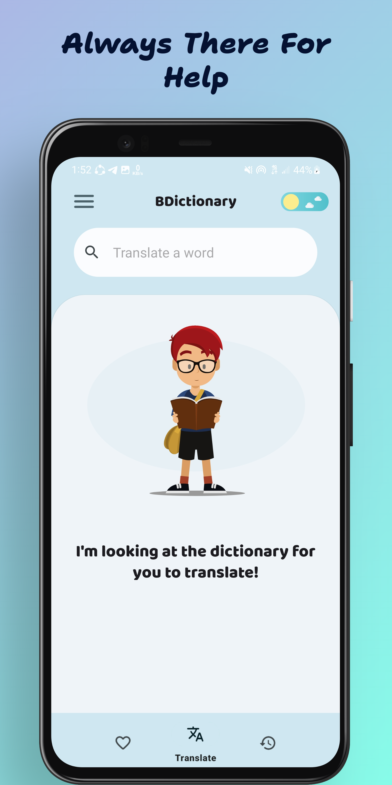
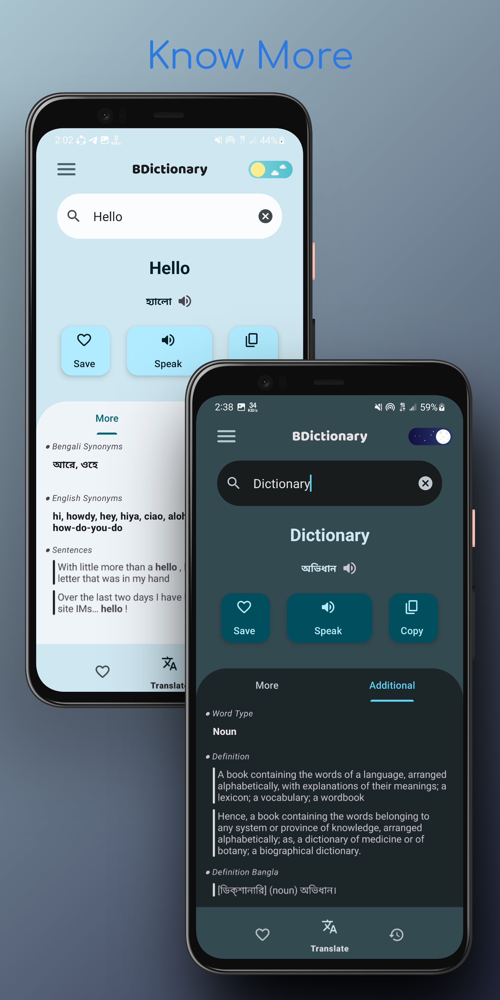
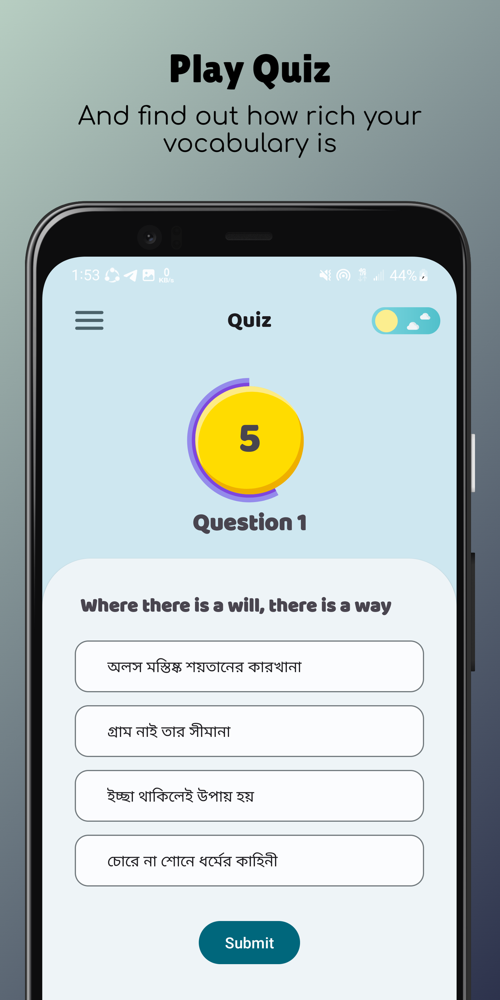
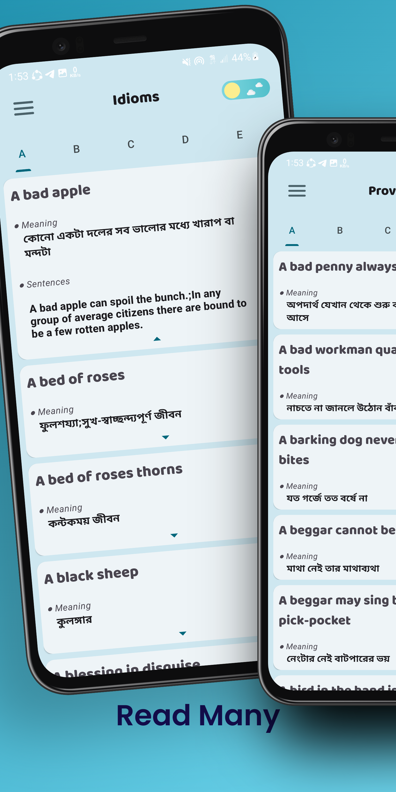
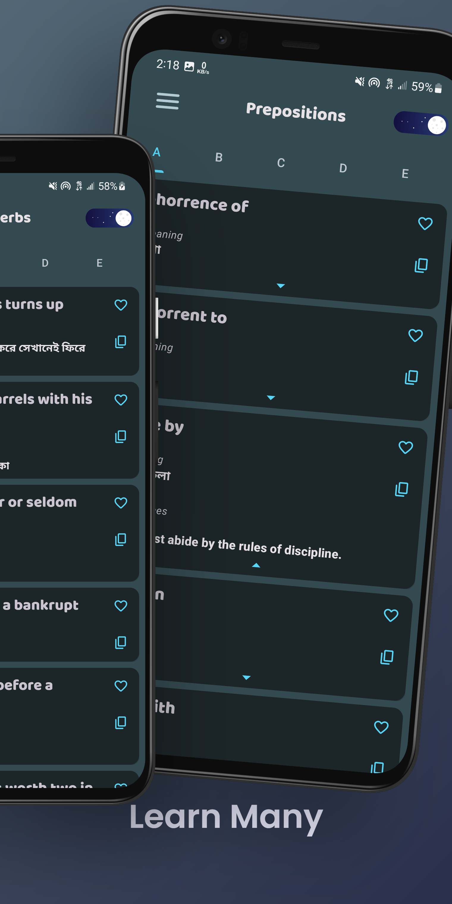

#  BDictionary

## Overview

Welcome to BDictionary! BDictionary is designed to help users with Bengali to English translations, English grammar learning, idioms, proverbs, prepositions, and even a fun quiz feature. Whether you are a language enthusiast, a student, or someone looking to improve their language skills, this app has got you covered!  **_With of course an awesome UI_**

## Features

- **Bengali to English Translation:** Easily translate Bengali words or phrases to English, providing you with accurate and helpful translations.

- **Synonyms and Antonyms:** Expand your vocabulary with synonyms and antonyms for various words.
- **Definition and Word Type:** Expand your knowledge knowing the definition, word origin and the word type.

- **Idioms and Proverbs:** Discover a collection of popular idioms and proverbs in English, along with their meanings and usage.

- **Prepositions Guide:** Learn how to use prepositions correctly in various contexts, enhancing your understanding of English language nuances with their proper meaning.

- **Quiz Time:** Test your knowledge with the interactive quiz feature. It's a fun way to reinforce what you've learned!

## Screenshots
|||
-|-|-

|||
-|-
## How to Contribute

Contributions to the Dictionary App are always welcome! If you have an idea for a new feature, want to report a bug, or want to contribute code, feel free to submit a pull request. For major changes, it's best to open an issue first to discuss the proposed updates.

## Installation
**For general purpose:**
1. [Download](https://github.com/acpSiam/BDictionary/raw/master/app/release/BDictionary%20%5BV1%20-%201.0%20-%20AVA%5D.apk) and install as like an usual app. The app is not yet available in the app stores. So github is currently the only source of getting the app.
**For Devs**
To get started with the Dictionary App, follow these steps:

1. Clone this repository to your local machine using `git clone <repository-url>`.
2. Open the project in Android Studio.
3. Build the app and run it on an Android emulator or physical device.

## Feedback and Support

If you encounter any issues while using the app or have any suggestions for improvement, please feel free to open an issue on this GitHub repository. We value your feedback and will do our best to address your concerns.

## License

The Dictionary App is open-source project available for anyone.

--- _Thank you for checking out My Awesome Dictionary App! We hope you find it helpful and enjoy using it to enhance your language skills. Happy learning!_
